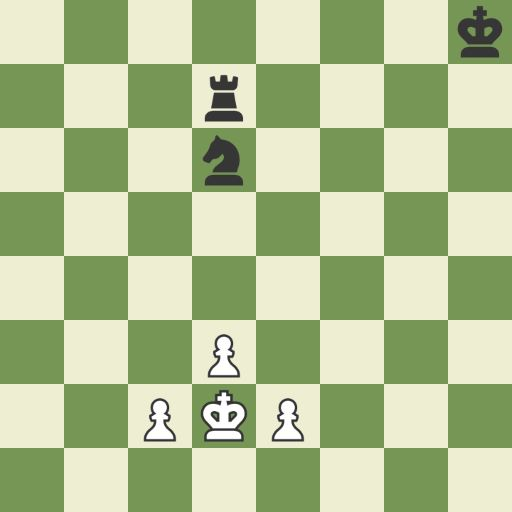
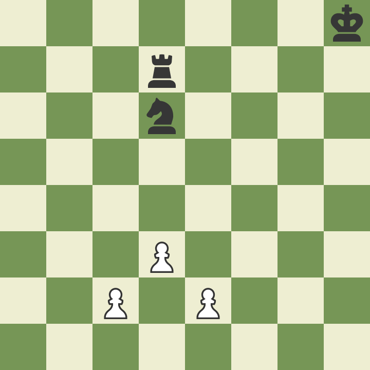

# tp-algo3

### Integrante
Ignacio García Pizales

### Juego
Ajedrez (voy a ver si puedo realizar la variante duck)

### Patron de diseño:
- Observer: Cuando se mueve una pieza pueden ocurrir cambios en otras piezas. Por ejemplo:

  
Aquí se puede ver que el caballo hace jaque al rey, el cual debe ser avisado para ser movido.
Ya que a la vez, no se puede comer el caballo con el peón ya que esta "clavado" por la torre que quedo descubierta

Links de interes:
- https://www.chess.com/news/view/chesscom-launches-duck-seirawan-setup-chess#duck-chess
- https://www.youtube.com/watch?v=U4ogK0MIzqk&t=23s (esta muy bueno este video si podes verlo por gusto)

